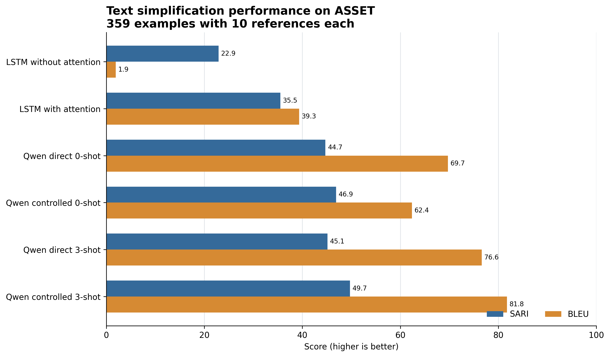
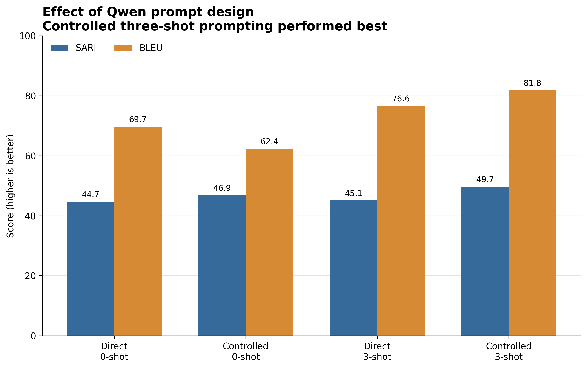
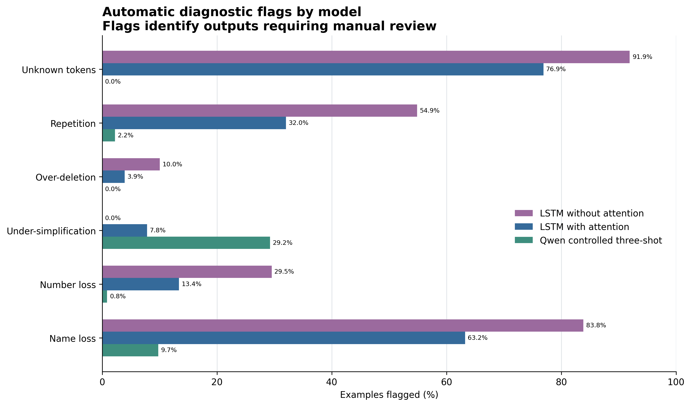

# CP468 Final Project: LSTM vs. LLM Text Simplification

## Submission Links

- **GitHub repository:** [CP468 Final Project](https://github.com/umberrao/CP468-Final-Project)
- **Video demonstration:** [Video Demo](https://drive.google.com/file/d/1CtBbPCeGhq3ac4Dda5xK7RCQgjCzOE_t/view?usp=sharing)


## Project Status

We have completed the project implementation and experimental evaluation. This includes dataset preparation, leakage validation, training the attention and no-attention models, full ASSET evaluation, local Qwen comparisons, qualitative analysis, error analysis, report figures, and automated testing.

All six evaluated configurations used the same frozen ASSET test set containing 359 examples with 10 human simplification references per example.

The written report has also been drafted. The remaining submission tasks are to add the final video link, complete the team-contribution and AI-use details, proofread the report, export it as a PDF, and submit the required materials.

## Project Goal

In this project, we compare a custom LSTM sequence-to-sequence model with a modern instruction-tuned Large Language Model for English text simplification.

- **Input:** Complex English text
- **Output:** Simplified English text
- **Training dataset:** WikiAuto
- **Evaluation dataset:** ASSET
- **Primary metric:** SARI
- **Secondary metric:** Lowercase SacreBLEU with 13a tokenization
- **Random seed:** 468

Our custom model uses a bidirectional LSTM encoder, an LSTM decoder, and masked additive attention. We compare it with a no-attention ablation and four prompting configurations of Qwen2.5-7B-Instruct.

## Final Results

| System                 | Prompt setting        |        SARI |        BLEU | Evaluation or generation time |
| ---------------------- | --------------------- | ----------: | ----------: | ----------------------------: |
| LSTM without attention | N/A                   |     22.9017 |      1.9097 |                         5.4 s |
| LSTM with attention    | N/A                   |     35.5013 |     39.3457 |                         7.7 s |
| Qwen2.5-7B-Instruct    | Direct zero-shot      |     44.7089 |     69.7172 |                       308.6 s |
| Qwen2.5-7B-Instruct    | Controlled zero-shot  |     46.8721 |     62.3587 |                       384.3 s |
| Qwen2.5-7B-Instruct    | Direct three-shot     |     45.1292 |     76.6130 |                       396.7 s |
| Qwen2.5-7B-Instruct    | Controlled three-shot | **49.7315** | **81.7931** |                       496.8 s |

The attention mechanism improved SARI by 12.5996 points compared with the no-attention ablation. This result demonstrates that attention substantially improved the custom model’s ability to retain and selectively use information from the source sentence.

The controlled three-shot Qwen configuration produced the best overall result. It improved SARI by 14.2263 points compared with the attention model.

We treat SARI as the primary evaluation metric because it measures the quality of text simplification operations. BLEU is reported as a secondary lexical-overlap metric and should not be interpreted as a complete measure of simplification quality.

Machine-readable experimental values are stored in:

```text
results/final_metrics.json
```

## Final Figures

### Overall Model Performance



### Effect of Qwen Prompt Design



### Automatic Diagnostic Flags



The figures can be regenerated using:

```powershell
python -m scripts.create_figures
```

## Dataset

We prepared the data from the `GEM/wiki_auto_asset_turk` dataset using streaming downloads from Hugging Face.

| Split      | Source   | Examples | References per example |
| ---------- | -------- | -------: | ---------------------: |
| Training   | WikiAuto |   50,000 |                      1 |
| Validation | WikiAuto |    2,000 |                      1 |
| Test       | ASSET    |      359 |                     10 |

We collected the validation and test splits before the training split. We then excluded any training source sentence that appeared in either held-out split.

The final leakage checks found:

- Zero training–holdout source overlaps
- Zero validation–test source overlaps
- Zero training examples removed for overlap in the final preparation run

We built the model vocabulary using only the training split. This prevents information from the validation or test sets from entering the vocabulary construction process.

Generated dataset files are excluded from Git because they can be reproduced using the preparation script.

Dataset licenses recorded in the generated manifest are:

- **WikiAuto training and validation:** CC BY-NC 3.0
- **ASSET test:** CC BY-NC 4.0

## Custom Model Architecture

We implemented the sequence-to-sequence models directly in PyTorch. The main architecture contains:

1. Token embeddings
2. A bidirectional LSTM encoder
3. Masked additive attention
4. An LSTM decoder
5. A vocabulary output projection
6. Greedy autoregressive inference

The attention mask prevents the decoder from attending to padding tokens.

For the ablation experiment, we retained the same dataset, preprocessing, vocabulary, encoder, decoder dimensions, training procedure, and inference method while disabling the attention mechanism.

### Shared Configuration

- **Embedding dimension:** 256
- **Encoder hidden dimension:** 256
- **Decoder hidden dimension:** 256
- **Attention dimension:** 256
- **Dropout:** 0.3
- **Maximum vocabulary size:** 20,000
- **Maximum source length:** 80 tokens
- **Maximum target length:** 80 tokens
- **Batch size:** 32
- **Maximum epochs:** 10
- **Learning rate:** 0.001
- **Gradient clipping:** 1.0
- **Mixed precision:** Enabled on CUDA
- **Training hardware:** NVIDIA Tesla T4

### Training Outcomes

| Model                  | Trainable parameters | Best epoch | Best validation loss | Best validation perplexity |                             Recorded training time |
| ---------------------- | -------------------: | ---------: | -------------------: | -------------------------: | -------------------------------------------------: |
| LSTM with attention    |           33,302,816 |          4 |               2.7854 |                      16.21 | Approximately 1,690.0 s to the selected checkpoint |
| LSTM without attention |           22,341,664 |          5 |               4.7791 |                     118.99 |                                          2,251.7 s |

The attention model achieved its best validation loss of 2.7854 and validation perplexity of 16.21 at epoch 4. Based on the timestamps of the saved vocabulary and best checkpoint, reaching the selected checkpoint required approximately 1,690 seconds, or 28.2 minutes, on a Tesla T4.

The attention run continued through epoch 7 before the session ended. Therefore, 1,690 seconds is an estimate of the time required to reach the selected epoch-4 checkpoint, not the exact duration of the entire interrupted run. The best epoch-4 checkpoint was preserved correctly.

The no-attention model completed all 10 configured epochs. Its best validation result occurred at epoch 5, after which validation performance stopped improving.

## Local LLM Baseline

We used `Qwen/Qwen2.5-7B-Instruct` as the Large Language Model comparison.

We ran the model locally on a Tesla T4 using 4-bit NF4 quantization. No paid API was used, resulting in an API cost of $0.

We evaluated four prompting conditions:

- Direct zero-shot
- Controlled zero-shot
- Direct three-shot
- Controlled three-shot

The three-shot experiments used the same three fixed WikiAuto training examples. We did not select demonstrations from the ASSET test set.

The exact system prompts, user prompt templates, and three-shot demonstrations are defined in:

```text
src/llm.py
```

The evaluation script uses deterministic greedy decoding with sampling disabled.

### Qwen Generation Configuration

- **Model:** Qwen/Qwen2.5-7B-Instruct
- **Quantization:** 4-bit NF4
- **Double quantization:** Enabled
- **Computation type:** Float16
- **Decoding:** Greedy
- **Sampling:** Disabled
- **Number of beams:** 1
- **Maximum input length:** 1,024 tokens
- **Maximum generated length:** 96 tokens
- **Random seed:** 468
- **Hardware:** NVIDIA Tesla T4

### Qwen Runtime

The four full Qwen evaluations required:

- **Total generation time:** 1,586.3 seconds
- **Approximate GPU usage:** 0.441 Tesla T4 GPU-hours
- **API cost:** $0

### Qwen Environment

- **PyTorch:** 2.10.0+cu128
- **Transformers:** 5.0.0
- **Accelerate:** 1.13.0
- **BitsAndBytes:** 0.50.0
- **SacreBLEU:** 2.6.0

## Qualitative and Error Analysis

We aligned predictions from the attention model, no-attention ablation, and best Qwen configuration across all 359 test examples.

We then selected 10 representative examples for side-by-side manual assessment.

The automatic diagnostic analysis checks for:

- Unknown tokens
- Repetition
- Possible over-deletion
- Possible under-simplification
- Possible number loss
- Added numbers
- Possible name loss

These diagnostic flags identify outputs that may require manual review. We do not treat every automatic flag as a definitive model error.

### Main Error-Analysis Findings

- Attention reduced unknown-token flags from 91.9% to 76.9%.
- Attention reduced repetition flags from 54.9% to 32.0%.
- Attention reduced name-loss flags from 83.8% to 63.2%.
- Qwen produced no unknown-token flags.
- Qwen produced repetition flags on only 2.2% of examples.
- Qwen produced name-loss flags on 9.7% of examples.
- Qwen produced number-loss flags on 0.8% of examples.
- Qwen was flagged for possible under-simplification on 29.2% of examples.

The results indicate that attention substantially improved the custom LSTM model, particularly by reducing repetition and information loss. However, the limited word-level vocabulary still caused frequent unknown tokens.

Qwen produced the strongest overall outputs and preserved names and numbers more reliably. Its main remaining weakness was occasional under-simplification.

The completed analysis files are stored in:

```text
results/analysis/qualitative_examples.md
results/analysis/error_counts.csv
```

## Reproducibility

We used the following measures to make the experiments reproducible:

- Fixed random seed of 468
- Pinned local and LLM dependencies
- Deterministic dataset preparation
- Training-only vocabulary construction
- Source-level leakage checks
- Dataset file hashes
- Configuration-based model experiments
- Gradient clipping
- Mixed-precision training support
- Validation-loss tracking
- Best-model checkpointing
- Exact Qwen prompt definitions
- Deterministic greedy decoding
- Resumable LLM evaluation
- Saved predictions and per-example SARI scores
- Saved aggregate metrics and runtime information
- Reproducible qualitative analysis
- Reproducible error analysis
- Reproducible report figures
- **47 automated tests passing**

## Installation

Run all commands from the repository root.

### Local Development Environment

The main requirements file installs CPU-only PyTorch for local Windows development:

```powershell
python -m pip install -r requirements.txt
```

The local dependency versions are pinned in `requirements.txt`.

### Colab LLM Environment

For the Qwen experiments, use a CUDA-enabled Google Colab runtime.

Do not install the CPU-only PyTorch version from `requirements.txt` in Colab. Colab supplies its own CUDA-enabled PyTorch build.

Install the LLM-specific packages using:

```bash
python -m pip install -r requirements-llm.txt
```

## Running the Project

### Prepare the Final Dataset

```powershell
python scripts/prepare_data.py --train-size 50000 --validation-size 2000 --shuffle-buffer 10000 --output-dir data/raw/final
```

Expected output:

```text
Train examples:      50000
Validation examples: 2000
Test examples:       359
Removed overlaps:    0
Leakage check:       PASSED
Manifest:            data/raw/final/manifest.json
```

### Run the Automated Tests

```powershell
python -m pytest -q
```

Expected result:

```text
47 passed
```

### Train the Attention Model

This command should be run in a CUDA-enabled environment:

```powershell
python -m scripts.train --config configs/final.yaml
```

### Train the No-Attention Ablation

```powershell
python -m scripts.train --config configs/no_attention.yaml
```

### Evaluate the Attention Model

```powershell
python -m scripts.evaluate --test-data data/raw/final/test.jsonl --checkpoint checkpoints/final/best.pt --vocabulary checkpoints/final/vocabulary.json --output-dir results/attention
```

### Evaluate the No-Attention Model

```powershell
python -m scripts.evaluate --test-data data/raw/final/test.jsonl --checkpoint checkpoints/no_attention/best.pt --vocabulary checkpoints/no_attention/vocabulary.json --output-dir results/no_attention
```

### Run a Custom Simplification

```powershell
python -m scripts.simplify --text "The scientist conducted an extensive investigation into the complicated problem." --checkpoint checkpoints/final/best.pt --vocabulary checkpoints/final/vocabulary.json
```

### Run the Local Qwen Evaluation

```bash
python -m scripts.evaluate_llm --test-data data/raw/final/test.jsonl --output-dir results/qwen2_5_7b
```

The Qwen evaluator:

- Validates all 359 ASSET test records
- Verifies that every example contains 10 references
- Evaluates all four prompt configurations
- Saves progress during generation
- Resumes safely after an interruption
- Saves predictions and aggregate metrics for every configuration

### Analyze the Model Outputs

```powershell
python -m scripts.analyze_results --attention results/attention/predictions.jsonl --no-attention results/no_attention/predictions.jsonl --qwen results/qwen2_5_7b/controlled_3shot/predictions.jsonl --output-dir results/analysis
```

### Generate the Report Figures

```powershell
python -m scripts.create_figures
```

## Project Structure

```text
CP468-Final-Project/
|-- checkpoints/
|-- configs/
|   |-- final.yaml
|   |-- no_attention.yaml
|   `-- smoke.yaml
|-- data/
|   |-- processed/
|   `-- raw/
|-- report/
|   `-- figures/
|       |-- error_rates.png
|       |-- model_scores.png
|       `-- qwen_prompt_comparison.png
|-- results/
|   |-- analysis/
|   |   |-- error_counts.csv
|   |   `-- qualitative_examples.md
|   `-- final_metrics.json
|-- scripts/
|   |-- analyze_results.py
|   |-- create_figures.py
|   |-- evaluate.py
|   |-- evaluate_llm.py
|   |-- prepare_data.py
|   |-- simplify.py
|   `-- train.py
|-- src/
|   |-- models/
|   |   |-- attention.py
|   |   |-- decoder.py
|   |   |-- encoder.py
|   |   `-- seq2seq.py
|   |-- analysis.py
|   |-- data.py
|   |-- inference.py
|   |-- llm.py
|   |-- metrics.py
|   |-- text.py
|   `-- training.py
|-- tests/
|-- requirements-llm.txt
|-- requirements.txt
`-- README.md
```

Generated datasets and model checkpoints are excluded from Git because they are large and can be recreated using the provided scripts. The final aggregate metrics, qualitative analysis, error counts, report figures, configurations, and source code are included in the repository.

## Completed Work

- [x] Reproducible WikiAuto and ASSET data pipeline
- [x] Leakage-free 50,000/2,000/359 data splits
- [x] Training-only vocabulary construction
- [x] Custom bidirectional LSTM sequence-to-sequence model
- [x] Masked additive attention
- [x] No-attention ablation
- [x] GPU training with mixed precision
- [x] Validation tracking and checkpointing
- [x] SARI evaluation
- [x] SacreBLEU evaluation
- [x] Full 359-example ASSET evaluation
- [x] Evaluation with 10 references per test example
- [x] Qwen zero-shot comparison
- [x] Qwen three-shot comparison
- [x] Direct and controlled prompt variants
- [x] Local 4-bit Qwen inference
- [x] LLM runtime and cost accounting
- [x] Resumable LLM evaluation
- [x] Qualitative analysis of 10 examples
- [x] Automatic diagnostic analysis
- [x] Manual error assessment
- [x] Final metrics file
- [x] Final report figures
- [x] Attention training-time estimate documented
- [x] 47 automated tests passing
- [x] Final report drafted
